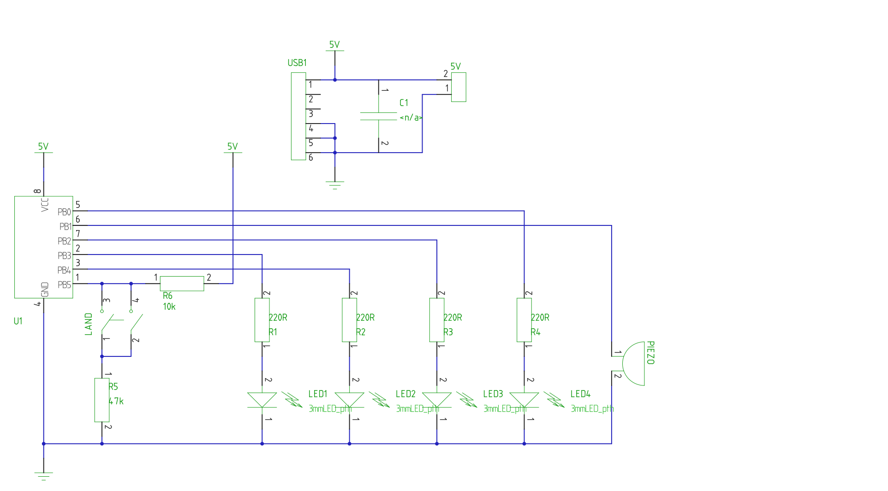
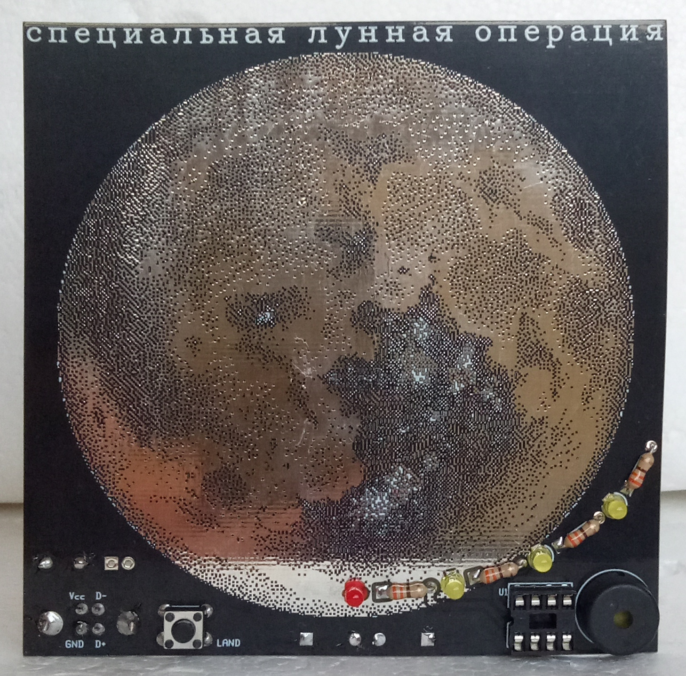

# STEM4ukraine-Special-Lunar-Mission

A simple PCB with sound effects and the animation set off by pressing of the button!

A fun school STEM project demonstrating use of GPIO for detecting button presses with software debouncing, driving multiple LEDs and playing sound effects on the Piezo speaker.

A linear feedback shift register is used to produce the white noise on landing.

Celebrate engineering, quality control and technical prowess of the russian federation with the simulation of the crash landing of the lunar probe onto the moon!

The schematic:

The front of the PCB:

Bill of materials:

-C1, 100nF
-SW1 Tactile 6x6 momentary switch
-LED1, LED2, LED3, LED4  3mm LED
-PIEZO 5mm to 7.62mm pitch piezo speaker
-R6 10k
-R1, R2, R3, R4  220R
-R5  47k
-USB1  USB B 180 degree socket
-U1  dip8 attiny13
